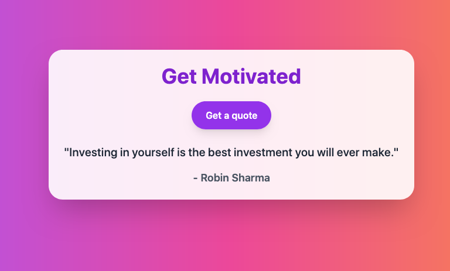

# 💡 Motivation App

A simple web app built with **FastAPI** that shows random motivational quotes.

---

## Features

* Fetches and displays random quotes.
* Simple, responsive, and clean UI with **Tailwind CSS**.
* No JavaScript required — fully backend-rendered.

### Screenshot

---

## Installation

```bash
git clone https://github.com/yourusername/motivation-app.git
cd motivation-app
python -m venv venv
# Activate venv:
# Windows: venv\Scripts\activate
# Mac/Linux: source venv/bin/activate
pip install -r requirements.txt
uvicorn main:app --reload
```

Open [http://127.0.0.1:8000](http://127.0.0.1:8000) in your browser.

---

## Project Structure

```
motivation-app/
├── main.py
├── templates/index.html
├── static/           # Optional CSS/images
├── requirements.txt
└── README.md
```

---

## License

MIT License